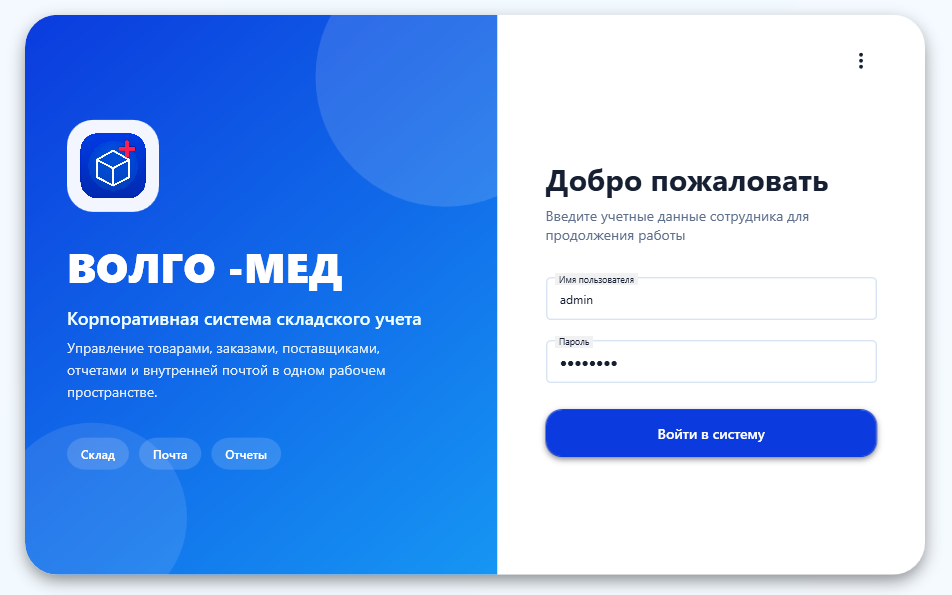
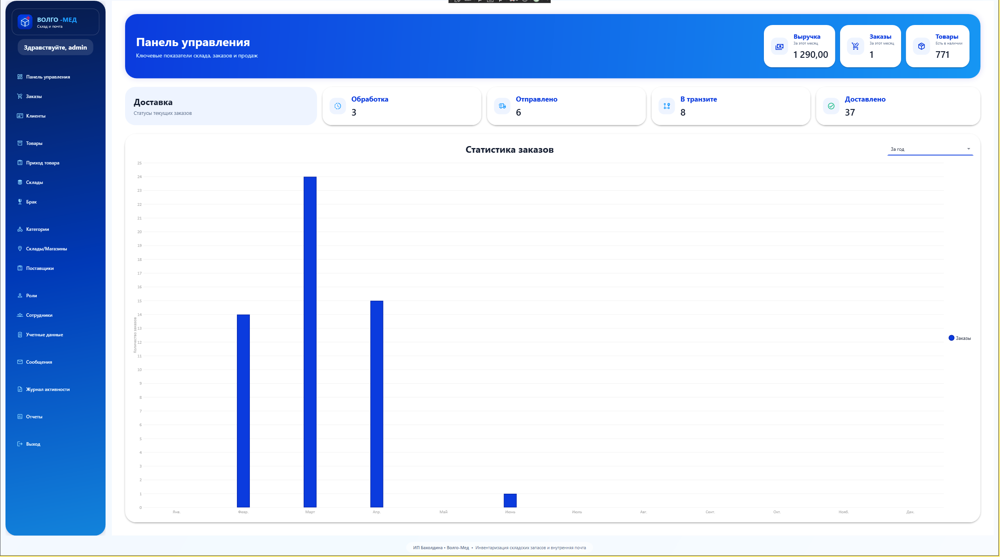
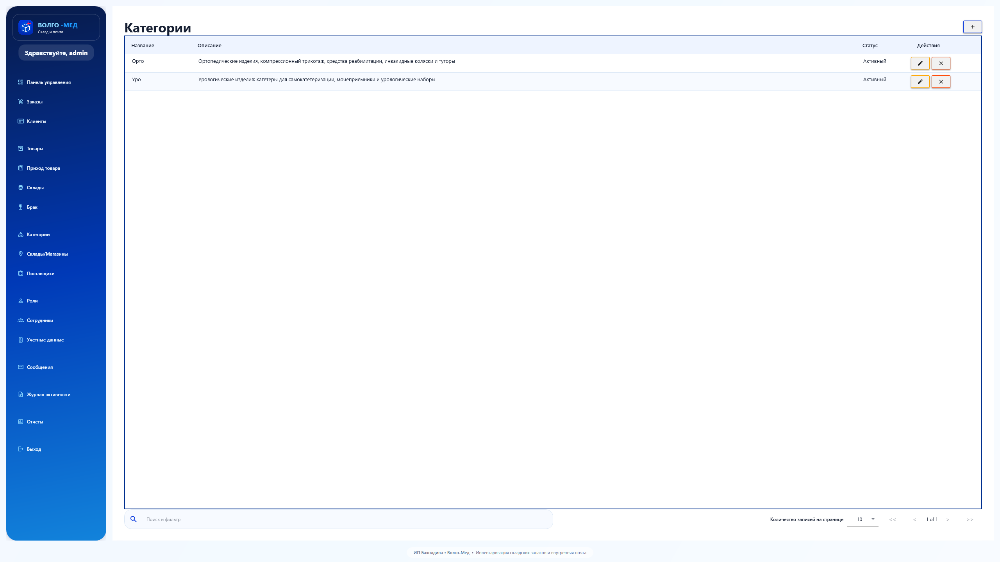
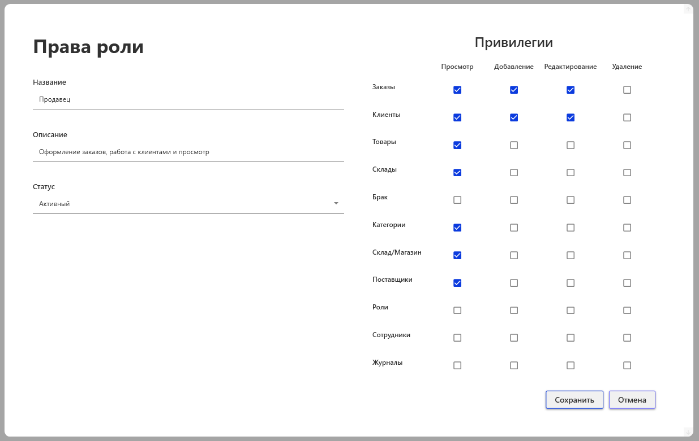
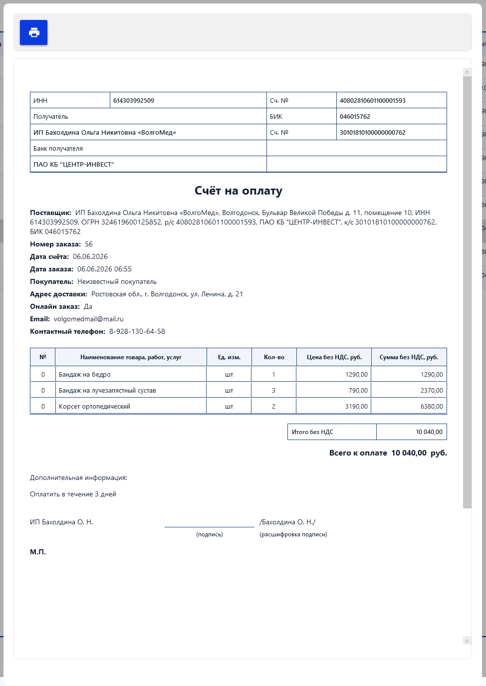

<div id="top"></div>

<div align="center">

# StockKeeperMail

Клиент-серверная система складского учета на WPF, ASP.NET Core Web API и MongoDB


</div>

---

## Содержание

- [О проекте](#о-проекте)
- [Ключевые возможности](#ключевые-возможности)
- [Скриншоты интерфейса](#скриншоты-интерфейса)
- [Архитектура решения](#архитектура-решения)
- [Структура проекта](#структура-проекта)
- [Технологический стек](#технологический-стек)
- [Используемые библиотеки](#используемые-библиотеки)
- [Быстрый старт](#быстрый-старт)
- [Настройка конфигурации](#настройка-конфигурации)
- [Добавление роли и сотрудника](#добавление-роли-и-сотрудника)
- [Проверка API](#проверка-api)
- [XML--Summary-документация](#xml--summary-документация)

## О проекте

**StockKeeperMail** — это система для управления складскими остатками, товарами, заказами, поставщиками, ролями пользователей, сотрудниками, локациями хранения, внутренними сообщениями и журналом действий.

Текущая версия проекта переведена на клиент-серверную архитектуру:

**WPF Desktop → ASP.NET Core Web API → MongoDB**

> [!IMPORTANT]
> В рабочем запуске участвуют три основных проекта:
> - **StockKeeperMail.Desktop** — WPF-клиент
> - **StockKeeperMail.Api** — ASP.NET Core Web API
> - **StockKeeperMail.Contracts** — общий модуль моделей, используемый Desktop и API

> [!NOTE]
> В solution также присутствует `StockKeeperMail.Database`, но в текущей MongoDB-версии он не участвует в основном сценарии запуска и сохранен как часть более ранней реализации проекта

## Ключевые возможности

### Авторизация и роли
- вход в систему по логину и паролю
- ролевая модель доступа
- гибкое управление правами на просмотр, добавление, изменение и удаление данных

### Работа со складом и товарами
- управление товарами, категориями и поставщиками
- учет остатков и доступности товаров
- размещение товаров по локациям хранения
- учет бракованной продукции

### Работа с заказами
- создание и редактирование заказов
- хранение строк заказа
- расчет общей суммы заказа
- управление статусами доставки

### Управление персоналом и внутренними процессами
- ведение сотрудников и ролей
- внутренние сообщения между сотрудниками
- журналирование действий
- просмотр основных данных через единый клиентский интерфейс

## Скриншоты интерфейса

### LoginView


### MainWindow


### CategoryListView


### RoleFormView


### PrintInvoiceView


## Архитектура решения

```text
WPF Desktop (StockKeeperMail.Desktop)
        |
        | HTTP / JSON
        v
ASP.NET Core Web API (StockKeeperMail.Api)
        |
        | MongoDB.Driver
        v
MongoDB (StockKeeperMailDb)
```

### Что изменено относительно старой версии
- прямое подключение WPF-клиента к SQL Server убрано
- доступ к данным вынесен в `StockKeeperMail.Api`
- общие модели вынесены в `StockKeeperMail.Contracts`
- клиент работает через `HttpClient`
- данные хранятся в MongoDB

## Структура проекта

```text
StockKeeperMail/
├── StockKeeperMail.Api/               # ASP.NET Core Web API
├── StockKeeperMail.Contracts/         # Общие модели для API и Desktop
├── StockKeeperMail.Desktop/           # WPF-клиент
├── StockKeeperMail.Database/          # Старый SQL-проект
├── Xml/                               # XML-документация по модулям
├── images/                            # Скриншоты интерфейса
├── README.md
└── StockKeeperMail.slnx
```

## Технологический стек

- **Язык программирования:** C#
- **Платформа:** .NET 10
- **Клиент:** WPF + XAML + MVVM
- **Сервер:** ASP.NET Core Web API
- **Транспорт:** HTTP / JSON
- **Хранение данных:** MongoDB
- **Общий модуль моделей:** StockKeeperMail.Contracts

## Используемые библиотеки

### Desktop
- [CommunityToolkit.Mvvm](https://www.nuget.org/packages/CommunityToolkit.Mvvm/)
- [LiveCharts.Wpf.Core](https://www.nuget.org/packages/LiveCharts.Wpf.Core/)
- [MaterialDesignThemes](https://www.nuget.org/packages/MaterialDesignThemes/)
- [MaterialDesignColors](https://www.nuget.org/packages/MaterialDesignColors/)
- [Microsoft.Extensions.Configuration](https://www.nuget.org/packages/Microsoft.Extensions.Configuration/)
- [Microsoft.Extensions.Configuration.Json](https://www.nuget.org/packages/Microsoft.Extensions.Configuration.Json/)
- [Microsoft.Extensions.Hosting](https://www.nuget.org/packages/Microsoft.Extensions.Hosting/)

### API и контракты
- [MongoDB.Driver](https://www.nuget.org/packages/MongoDB.Driver/)
- [MongoDB.Bson](https://www.nuget.org/packages/MongoDB.Bson/)

### Платформа и фреймворки
- [ASP.NET Core Web API](https://learn.microsoft.com/aspnet/core/web-api/)
- [Windows Presentation Foundation (WPF)](https://learn.microsoft.com/dotnet/desktop/wpf/)

## Быстрый старт

### Требования

- Visual Studio 2022 или новее
- .NET 10 SDK
- MongoDB Community Server
- MongoDB Compass, опционально, для просмотра данных

### Запуск через Visual Studio

1. Открой `StockKeeperMail.slnx`
2. Восстанови NuGet-пакеты
3. Установи несколько стартовых проектов:
   - `StockKeeperMail.Api`
   - `StockKeeperMail.Desktop`
4. Убедись, что API стартует раньше Desktop-клиента
5. Запусти решение

### Запуск через терминал

#### 1. Запусти MongoDB

Убедись, что сервер MongoDB доступен по адресу `mongodb://localhost:27017`

#### 2. Запусти API

```powershell
cd StockKeeperMail.Api
dotnet restore
dotnet run
```

Ожидаемый результат:

```text
Now listening on: http://localhost:5194
```

#### 3. Запусти Desktop-клиент

В новом окне терминала:

```powershell
cd StockKeeperMail.Desktop
dotnet restore
dotnet run
```

> [!IMPORTANT]
> `StockKeeperMail.Contracts` запускается не отдельно, а подключается как общий проект-зависимость для Desktop и API

## Настройка конфигурации

### Настройка API

Файл: `StockKeeperMail.Api/appsettings.json`

```json
{
  "MongoDb": {
    "ConnectionString": "mongodb://localhost:27017",
    "DatabaseName": "StockKeeperMailDb"
  },
  "Kestrel": {
    "Endpoints": {
      "Http": {
        "Url": "http://localhost:5194"
      }
    }
  }
}
```

### Настройка Desktop-клиента

Файл: `StockKeeperMail.Desktop/apiconfig.json`

```json
{
  "Api": {
    "BaseUrl": "http://localhost:5194"
  }
}
```

> [!NOTE]
> Значение `BaseUrl` в `apiconfig.json` должно совпадать с адресом, на котором запущен `StockKeeperMail.Api`

## Добавление роли и сотрудника

После первого запуска база MongoDB может быть пустой. Для входа в систему нужно сначала создать хотя бы одну роль и одного сотрудника.

> [!WARNING]
> В текущей версии нет автоматического seed-заполнения базы, поэтому стартовые записи нужно добавить вручную

### 1. Добавление роли

```powershell
Invoke-RestMethod \
  -Method Post \
  -Uri "http://localhost:5194/api/roles" \
  -ContentType "application/json" \
  -Body @'
{
  "RoleID": "11111111-1111-1111-1111-111111111111",
  "RoleName": "Administrator",
  "RoleStatus": "Active",
  "RoleDescription": "System administrator",
  "OrdersView": true,
  "OrdersAdd": true,
  "OrdersEdit": true,
  "OrdersDelete": true,
  "CustomersView": true,
  "CustomersAdd": true,
  "CustomersEdit": true,
  "CustomersDelete": true,
  "ProductsView": true,
  "ProductsAdd": true,
  "ProductsEdit": true,
  "ProductsDelete": true,
  "StoragesView": true,
  "StoragesAdd": true,
  "StoragesEdit": true,
  "StoragesDelete": true,
  "DefectivesView": true,
  "DefectivesAdd": true,
  "DefectivesEdit": true,
  "DefectivesDelete": true,
  "CategoriesView": true,
  "CategoriesAdd": true,
  "CategoriesEdit": true,
  "CategoriesDelete": true,
  "LocationsView": true,
  "LocationsAdd": true,
  "LocationsEdit": true,
  "LocationsDelete": true,
  "SuppliersView": true,
  "SuppliersAdd": true,
  "SuppliersEdit": true,
  "SuppliersDelete": true,
  "RolesView": true,
  "RolesAdd": true,
  "RolesEdit": true,
  "RolesDelete": true,
  "StaffsView": true,
  "StaffsAdd": true,
  "StaffsEdit": true,
  "StaffsDelete": true,
  "LogsView": true,
  "LogsAdd": true,
  "LogsEdit": true,
  "LogsDelete": true
}
'@
```

### 2. Добавление сотрудника

```powershell
Invoke-RestMethod \
  -Method Post \
  -Uri "http://localhost:5194/api/staff" \
  -ContentType "application/json" \
  -Body @'
{
  "StaffID": "22222222-2222-2222-2222-222222222222",
  "RoleID": "11111111-1111-1111-1111-111111111111",
  "StaffFirstName": "Admin",
  "StaffLastName": "User",
  "StaffAddress": "Office",
  "StaffPhone": "+70000000000",
  "StaffEmail": "admin@local.test",
  "StaffUsername": "admin",
  "StaffPassword": "admin123"
}
'@
```

### 3. Проверка, что записи созданы

```powershell
Invoke-RestMethod -Method Get -Uri "http://localhost:5194/api/roles"
Invoke-RestMethod -Method Get -Uri "http://localhost:5194/api/staff"
```

### 4. Данные для входа

```text
Логин: admin
Пароль: admin123
```

## Проверка API

Для быстрой проверки доступности API открой:

```text
http://localhost:5194/api/health
```

Если сервис запущен корректно, endpoint вернет успешный ответ со статусом API

## XML / Summary-документация

В проекте подключена генерация XML-документации для публичных типов и членов. Готовые файлы размещаются в папке `Xml`.

- [Документация API-модуля](Xml/StockKeeperMail.Api.xml)
- [Документация Contracts-модуля](Xml/StockKeeperMail.Contracts.xml)
- [Документация Desktop-модуля](Xml/StockKeeperMail.Desktop.xml)
- [Документация Database-модуля](Xml/StockKeeperMail.Database.xml)

> [!TIP]
> XML-файлы удобно использовать для навигации по публичному API проекта, проверки summary-комментариев и последующей публикации документации

---

<div align="right">
  <a href="#top">Наверх ↑</a>
</div>
